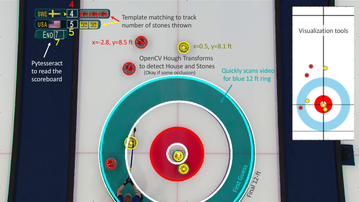
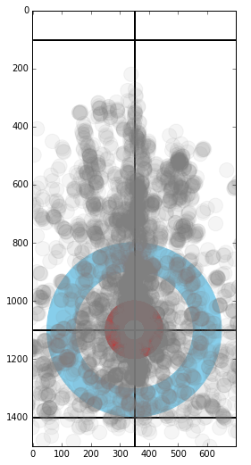

# Curlovision
Curling computer vision project for extracting stone positions from broadcast footage.  The purpose is to build a data set of stone positions in high level curling matches, to be used in generating predictive models of the score or next stone positions.

# Dependencies
Curlovision is written in Python (tested with v2.7) taking advantage of OpenCV, Matplotlib, Numpy, and Pytesseract.

  * OpenCV
  * Matplotlib
  * Numpy
  * Pytesseract

# Usage

Main functions/classes can be imported from 'curlovision.py'.

'Process Batch.ipynb' is an example for processing video broadcasts of curling matches.
  * Video files must be in mp4 format, 1 match per file.
  * Video assumed to have 15 fps with resolution 1920x1080.  Higher framerates can be processed efficiently with higher nskip values.
  * Every 5th frame (default) is searched for the blue ice of the 12ft ring in the house.  When found, a ShortTermMemory starts collecting frames until the blue ice disappears.  Key frames are identified and processed, generally much faster than a video would play.  Hough Transforms are used to quickly find rings of the house and stones.  The scoreboard and games status are read and recorded using pytesseract and OpenCV template matching.  
  * cvis.process_video function returns a custom MatchResult object that contains the results from each end of the match.  Each EndResult contains the stone positions in feet after each stone is thrown.  The number of stones remaining to be thrown by red and yellow teams are also recorded, along with the team that has the hammer (last stone in the end).
  * As a starting place, MatchResults know how to .draw() themselves.

'Visualize.ipynb' is an example for parsing and visualizing the MatchResults.  It was used to generate the example heatmap image:

# Common Failures

Curlovision is not perfect.  Testing suggests typical stone positions are accurate to within 2 or 3 inches.  Perhaps 1 or 2% of StoneLayouts are off by ~10%, due to players/stones obstructing too much of the house and ruining the measurement metrics.  There are occassionaly false positive stones (e.g. matching a round head with a red hat).  Stones with ~20% occlusion from players and brooms can be overlooked.  

There may not be a StoneLayout for every stone thrown, especially in cases where the broadcast footage does not provide a clean overhead view of the house after, e.g., inconsoquential stones.  Often the very last stone thrown is not shown during broadcast if the outcome is already clear.

Various levels to debugging can be enabled to during video processing to look at intermediate performance of process_video.

# Open Source

Curolovision is released under a BSD license and is free for both academic and commercial use.
